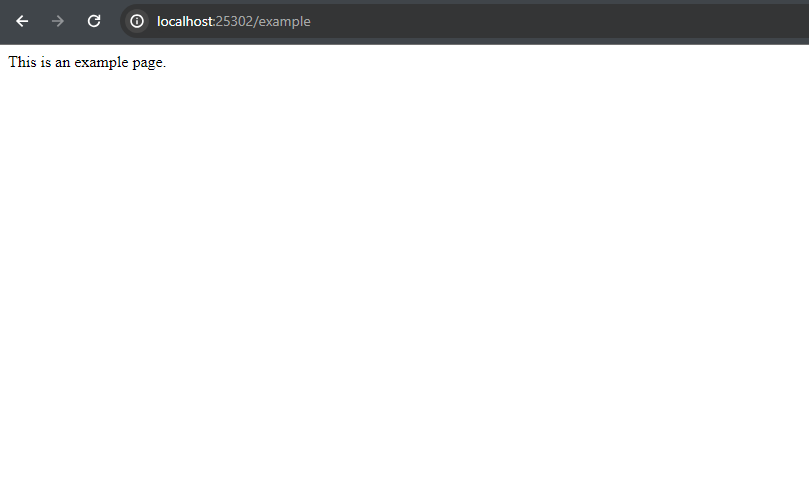
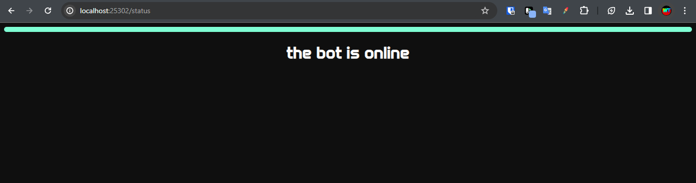

Let's add the first part

```diff lang="js"
+app.get("/example", (req, res) => {
+
+})
```

This part allows you to load a new page
:::danger
if you run the code without having put anything the page will not load
:::
:::note
If you want to customize the name of the page Edit just where it says example
:::

Now let's add some text to the page

```diff lang="js"
 app.get("/example", (req, res) => {
+res.send("This is an example page.");
 })
```

Well your first page is now online



and if you want to go further
here is a status page

```diff lang="js"
+app.get("/status", (req, res) => {
+   res.send('<!DOCTYPE html><html lang="en"><head><meta charset="UTF-8" /><meta name="viewport" content="width=device-width, initial-scale=1.0" /><title>Document</title></head><link rel="stylesheet" href="https://extensions.aoijs.org/assets/onbot.css" /><div><div class="on"></div><h1>the bot is online</h1></div></html>');
+})
```

and it looks like this

