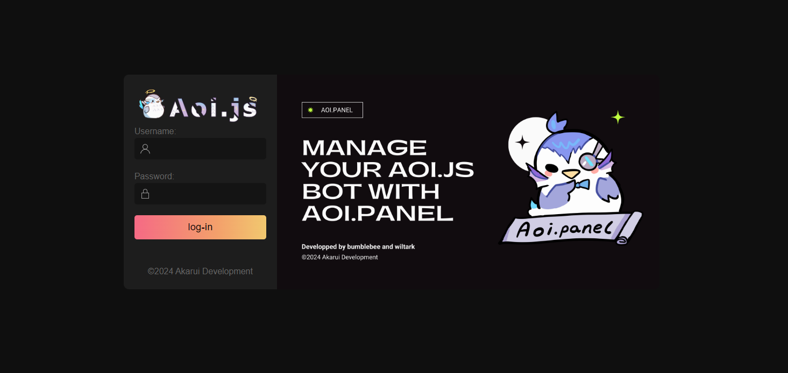

:::note
The installation will only be done in NPM
:::

:::danger
it is mandatory to install aoijs

```sh
npm i aoijs
```

:::

so if you have installed aoi js you can aoi.panel with the command below

```sh
npm i @akarui/aoi.panel
```

Then add the code with the prefix (+)

```diff lang="js"
+const {Panel} = require("@akarui/aoi.panel")
const {AoiClient} = require("aoi.js");

const client = new AoiClient({
    intents: ["MessageContent", "Guilds", "GuildMessages"],
    events: ["onMessage", "onInteractionCreate"],
    prefix: "Discord Bot Prefix",
    token: "Discord Bot Token",
    database: {
        type: "aoi.db",
        db: require("@akarui/aoi.db"),
        dbType: "KeyValue",
        tables: ["main"],
        securityKey: "a-32-characters-long-string-here",
    }
});


+client.loadCommands("./commands/", true);

+const panel = new Panel({
+    port: 3000,
+    client: client
+})

+panel.loadAPI({
+    auth: "Authentication-Key"//No spaces, keep it only alphanumeric.
+})

+panel.loadGUI({
+    username: ["username 1"],
+    password: ["Password 1"],
+})
```

You can add users

```diff lang="js"
panel.loadGUI({
+    username: ["username 1", "username 2", "username 3"],
+    password: ["Password 1", "Password 2", "Password 3"],
})
```

It's good, the panel is installed!!!


